# Roadmap Diagrams

> Mermaid diagrams for the full ratatoskr implementation roadmap.

## Phase Overview

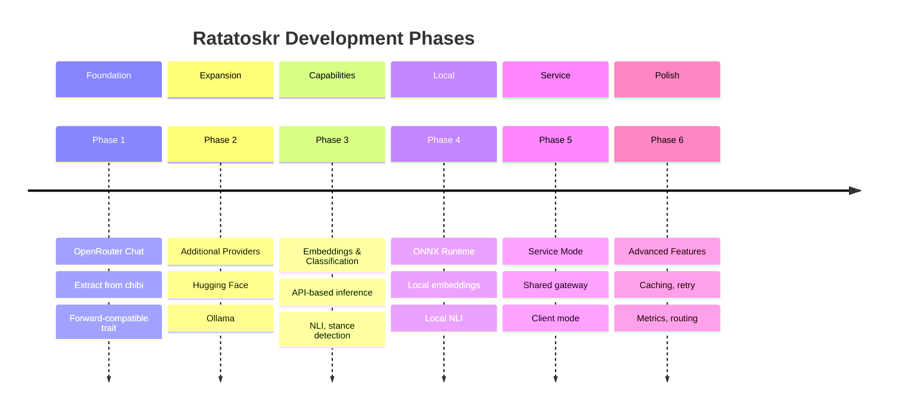
```mermaid
timeline
    title Ratatoskr Development Phases

    section Foundation
        Phase 1 : OpenRouter Chat
                : Extract from chibi
                : Forward-compatible trait

    section Expansion
        Phase 2 : Additional Providers
                : Hugging Face
                : Ollama

    section Capabilities
        Phase 3 : Embeddings & Classification
                : API-based inference
                : NLI, stance detection

    section Local
        Phase 4 : ONNX Runtime
                : Local embeddings
                : Local NLI

    section Service
        Phase 5 : Service Mode
                : Shared gateway
                : Client mode

    section Polish
        Phase 6 : Advanced Features
                : Caching, retry
                : Metrics, routing
```

## Ecosystem Architecture

### Full Vision

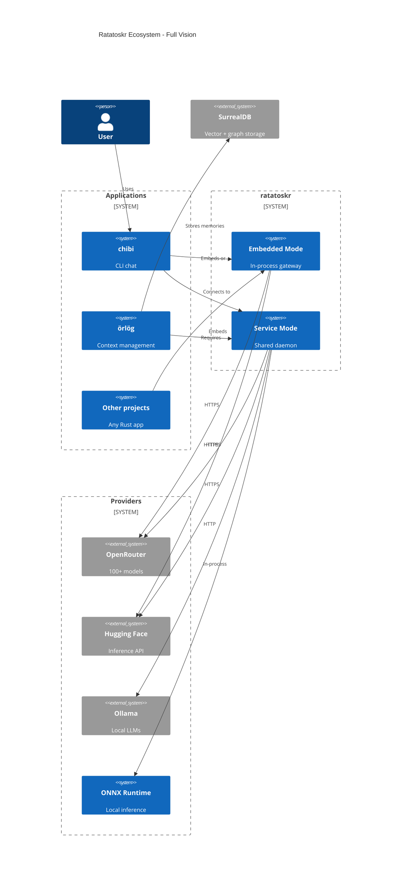
```mermaid
C4Context
    title Ratatoskr Ecosystem - Full Vision

    Person(user, "User")

    System_Boundary(apps, "Applications") {
        System(chibi, "chibi", "CLI chat")
        System(orlog, "örlög", "Context management")
        System(other, "Other projects", "Any Rust app")
    }

    System_Boundary(ratatoskr_boundary, "ratatoskr") {
        System(embedded, "Embedded Mode", "In-process gateway")
        System(service, "Service Mode", "Shared daemon")
    }

    System_Boundary(providers, "Providers") {
        System_Ext(openrouter, "OpenRouter", "100+ models")
        System_Ext(huggingface, "Hugging Face", "Inference API")
        System_Ext(ollama, "Ollama", "Local LLMs")
        System(onnx, "ONNX Runtime", "Local inference")
    }

    System_Ext(surrealdb, "SurrealDB", "Vector + graph storage")

    Rel(user, chibi, "Uses")
    Rel(chibi, embedded, "Embeds or")
    Rel(chibi, service, "Connects to")
    Rel(orlog, service, "Requires")
    Rel(orlog, surrealdb, "Stores memories")
    Rel(other, embedded, "Embeds")

    Rel(embedded, openrouter, "HTTPS")
    Rel(embedded, huggingface, "HTTPS")
    Rel(service, openrouter, "HTTPS")
    Rel(service, huggingface, "HTTPS")
    Rel(service, ollama, "HTTP")
    Rel(service, onnx, "In-process")
```

### Deployment Configurations

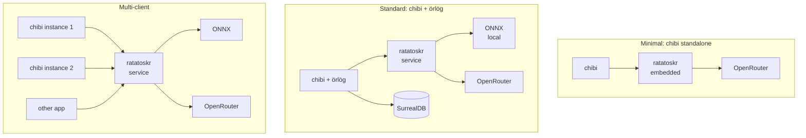
```mermaid
flowchart TB
    subgraph minimal["Minimal: chibi standalone"]
        chibi1[chibi]
        emb1[ratatoskr<br/>embedded]
        chibi1 --> emb1
        emb1 --> or1[OpenRouter]
    end

    subgraph standard["Standard: chibi + örlög"]
        chibi2[chibi + örlög]
        svc1[ratatoskr<br/>service]
        db1[(SurrealDB)]

        chibi2 --> svc1
        chibi2 --> db1
        svc1 --> onnx1[ONNX<br/>local]
        svc1 --> or2[OpenRouter]
    end

    subgraph multi["Multi-client"]
        chibi3a[chibi instance 1]
        chibi3b[chibi instance 2]
        other3[other app]
        svc2[ratatoskr<br/>service]

        chibi3a --> svc2
        chibi3b --> svc2
        other3 --> svc2
        svc2 --> onnx2[ONNX]
        svc2 --> or3[OpenRouter]
    end
```

## Provider Capabilities Matrix

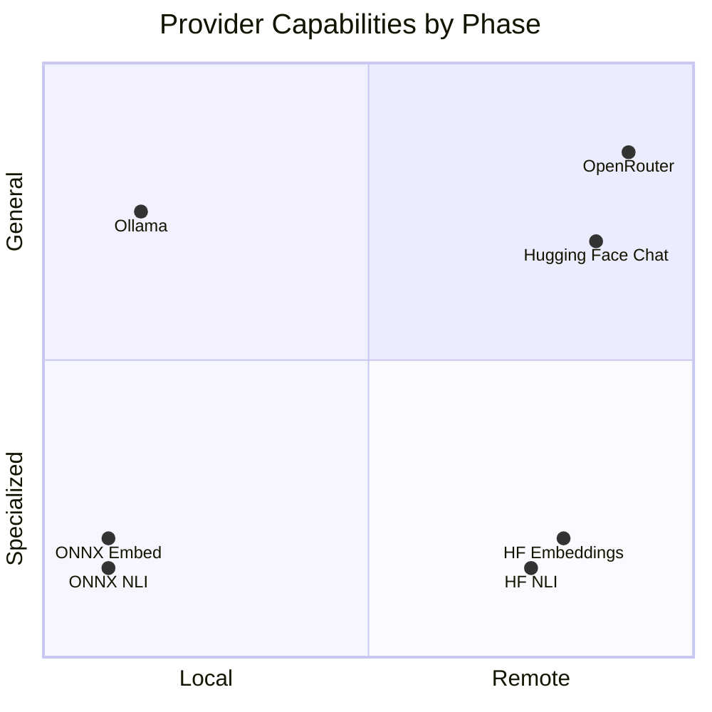
```mermaid
quadrantChart
    title Provider Capabilities by Phase
    x-axis Local --> Remote
    y-axis Specialized --> General

    OpenRouter: [0.9, 0.85]
    Hugging Face Chat: [0.85, 0.7]
    Ollama: [0.15, 0.75]
    HF Embeddings: [0.8, 0.2]
    HF NLI: [0.75, 0.15]
    ONNX Embed: [0.1, 0.2]
    ONNX NLI: [0.1, 0.15]
```

**Quadrants:**
- **Q1 (top-right)**: Remote General (Phase 1-2) - OpenRouter, HF Chat
- **Q2 (top-left)**: Local General (Phase 4-5) - Ollama, future local LLMs
- **Q3 (bottom-left)**: Local Specialized (Phase 4) - ONNX models
- **Q4 (bottom-right)**: Remote Specialized (Phase 2-3) - HF API for specific tasks

## Trait Evolution

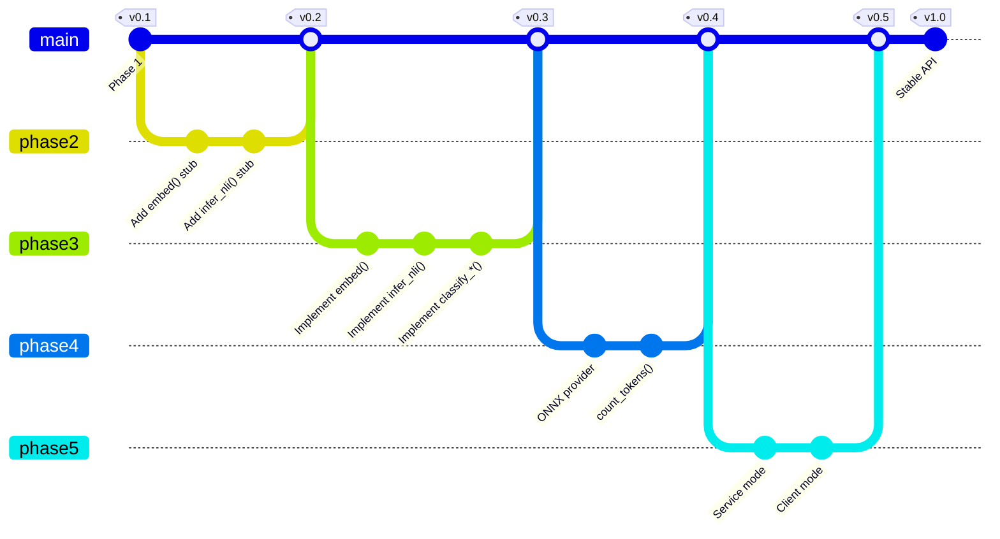
```mermaid
gitGraph
    commit id: "Phase 1" tag: "v0.1"
    branch phase2
    commit id: "Add embed() stub"
    commit id: "Add infer_nli() stub"
    checkout main
    merge phase2 tag: "v0.2"
    branch phase3
    commit id: "Implement embed()"
    commit id: "Implement infer_nli()"
    commit id: "Implement classify_*()"
    checkout main
    merge phase3 tag: "v0.3"
    branch phase4
    commit id: "ONNX provider"
    commit id: "count_tokens()"
    checkout main
    merge phase4 tag: "v0.4"
    branch phase5
    commit id: "Service mode"
    commit id: "Client mode"
    checkout main
    merge phase5 tag: "v0.5"
    commit id: "Stable API" tag: "v1.0"
```

## Phase 2: Provider Architecture

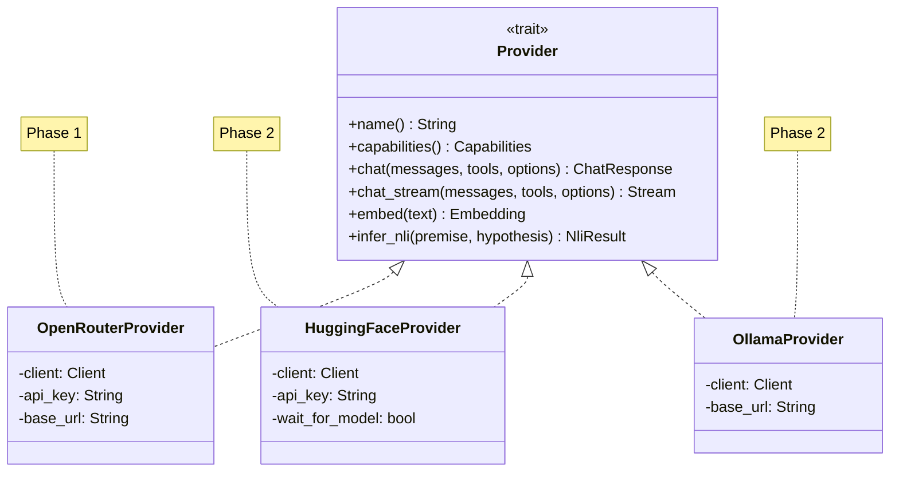
```mermaid
classDiagram
    class Provider {
        <<trait>>
        +name() String
        +capabilities() Capabilities
        +chat(messages, tools, options) ChatResponse
        +chat_stream(messages, tools, options) Stream
        +embed(text) Embedding
        +infer_nli(premise, hypothesis) NliResult
    }

    class OpenRouterProvider {
        -client: Client
        -api_key: String
        -base_url: String
    }

    class HuggingFaceProvider {
        -client: Client
        -api_key: String
        -wait_for_model: bool
    }

    class OllamaProvider {
        -client: Client
        -base_url: String
    }

    Provider <|.. OpenRouterProvider
    Provider <|.. HuggingFaceProvider
    Provider <|.. OllamaProvider

    note for OpenRouterProvider "Phase 1"
    note for HuggingFaceProvider "Phase 2"
    note for OllamaProvider "Phase 2"
```

## Phase 3: Capability Flow

### Embeddings

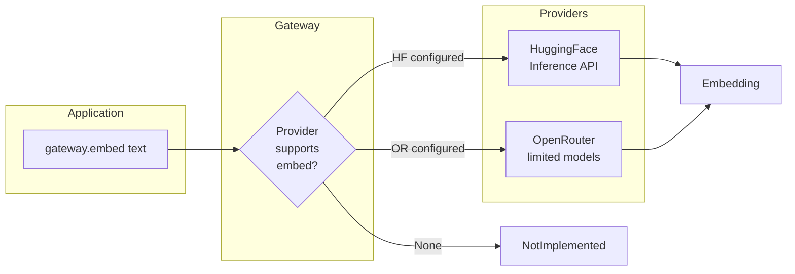
```mermaid
flowchart LR
    subgraph Application
        A[gateway.embed text]
    end

    subgraph Gateway
        B{Provider<br/>supports<br/>embed?}
    end

    subgraph Providers
        C[HuggingFace<br/>Inference API]
        D[OpenRouter<br/>limited models]
    end

    A --> B
    B -->|HF configured| C
    B -->|OR configured| D
    B -->|None| E[NotImplemented]

    C --> F[Embedding]
    D --> F
```

### NLI (Two-Stage Retrieval)

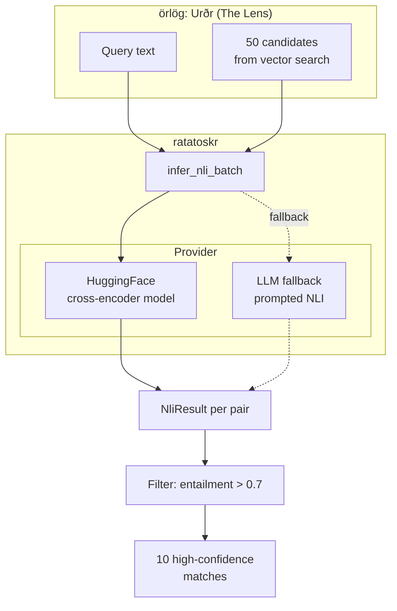
```mermaid
flowchart TB
    subgraph "örlög: Urðr (The Lens)"
        Query[Query text]
        Candidates[50 candidates<br/>from vector search]
    end

    subgraph "ratatoskr"
        Batch[infer_nli_batch]

        subgraph Provider
            HF[HuggingFace<br/>cross-encoder model]
            LLM[LLM fallback<br/>prompted NLI]
        end
    end

    Query --> Batch
    Candidates --> Batch
    Batch --> HF
    Batch -.->|fallback| LLM

    HF --> Results[NliResult per pair]
    LLM -.-> Results

    Results --> Filter[Filter: entailment > 0.7]
    Filter --> Final[10 high-confidence<br/>matches]
```

## Phase 4: ONNX Integration

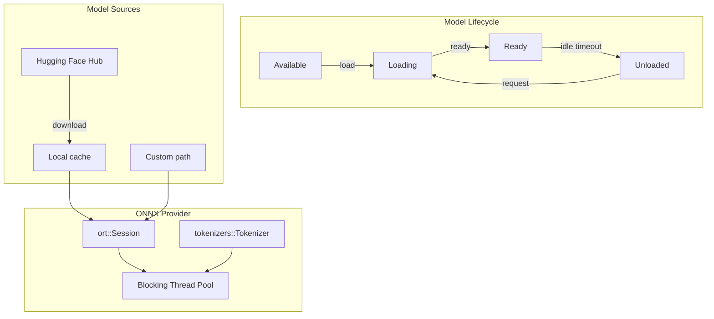
```mermaid
flowchart TB
    subgraph "Model Lifecycle"
        Available[Available] -->|load| Loading
        Loading -->|ready| Ready
        Ready -->|idle timeout| Unloaded
        Unloaded -->|request| Loading
    end

    subgraph "ONNX Provider"
        direction TB
        Session[ort::Session]
        Tokenizer[tokenizers::Tokenizer]
        ThreadPool[Blocking Thread Pool]

        Session --> ThreadPool
        Tokenizer --> ThreadPool
    end

    subgraph "Model Sources"
        HFHub[Hugging Face Hub]
        Local[Local cache]
        Custom[Custom path]
    end

    HFHub -->|download| Local
    Local --> Session
    Custom --> Session
```

### Memory Management

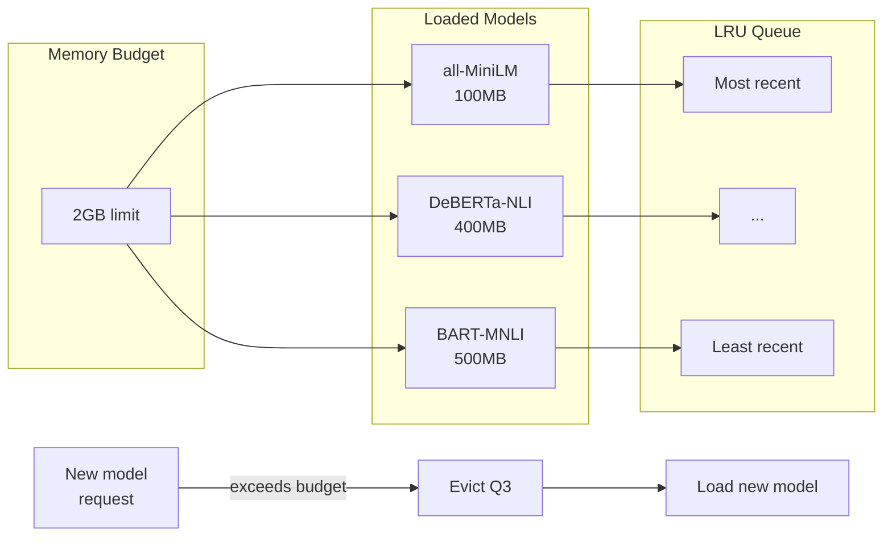
```mermaid
flowchart LR
    subgraph "Memory Budget"
        Budget[2GB limit]
    end

    subgraph "Loaded Models"
        Embed[all-MiniLM<br/>100MB]
        NLI[DeBERTa-NLI<br/>400MB]
        Stance[BART-MNLI<br/>500MB]
    end

    subgraph "LRU Queue"
        Q1[Most recent]
        Q2[...]
        Q3[Least recent]
    end

    Budget --> Embed
    Budget --> NLI
    Budget --> Stance

    Embed --> Q1
    NLI --> Q2
    Stance --> Q3

    NewModel[New model<br/>request] -->|exceeds budget| Evict[Evict Q3]
    Evict --> Load[Load new model]
```

## Phase 5: Service Architecture

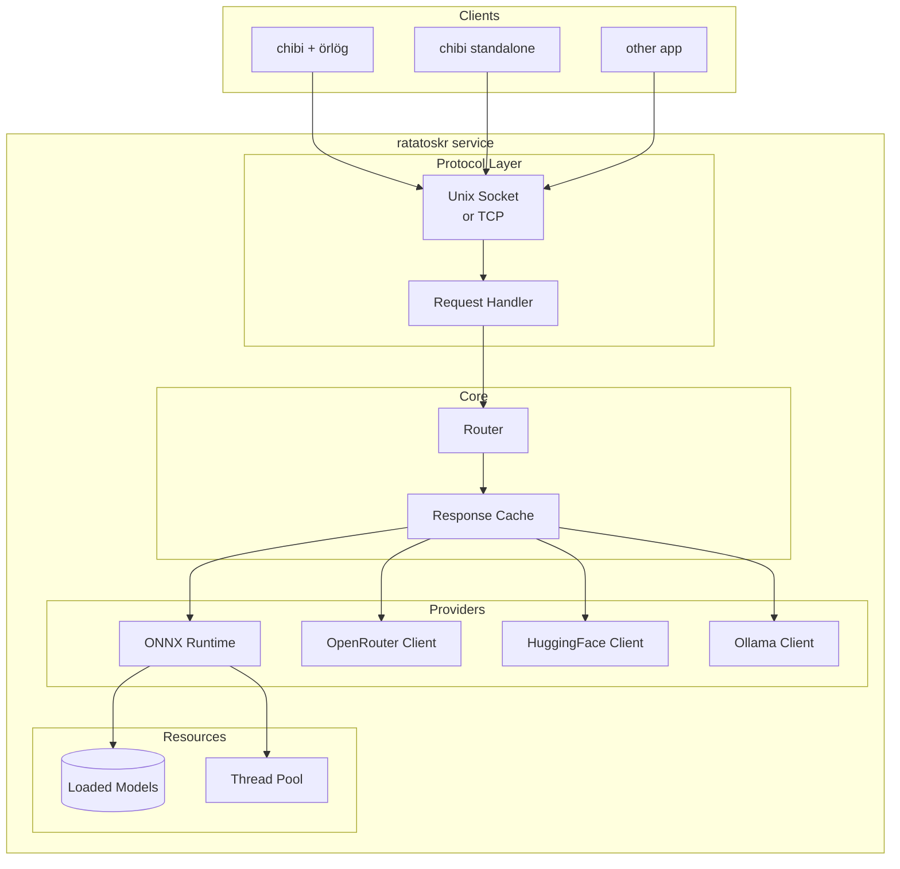
```mermaid
flowchart TB
    subgraph Clients
        C1[chibi + örlög]
        C2[chibi standalone]
        C3[other app]
    end

    subgraph "ratatoskr service"
        subgraph "Protocol Layer"
            Socket[Unix Socket<br/>or TCP]
            Handler[Request Handler]
        end

        subgraph "Core"
            Router[Router]
            Cache[Response Cache]
        end

        subgraph "Providers"
            ONNX[ONNX Runtime]
            OR[OpenRouter Client]
            HF[HuggingFace Client]
            Ollama[Ollama Client]
        end

        subgraph "Resources"
            Models[(Loaded Models)]
            Pool[Thread Pool]
        end
    end

    C1 --> Socket
    C2 --> Socket
    C3 --> Socket

    Socket --> Handler
    Handler --> Router
    Router --> Cache
    Cache --> ONNX
    Cache --> OR
    Cache --> HF
    Cache --> Ollama

    ONNX --> Models
    ONNX --> Pool
```

### Protocol Options

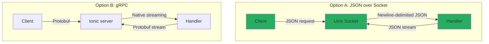
```mermaid
flowchart TB
    subgraph "Option A: JSON over Socket"
        J1[Client] -->|JSON request| J2[Unix Socket]
        J2 -->|Newline-delimited JSON| J3[Handler]
        J3 -->|JSON stream| J2
    end

    subgraph "Option B: gRPC"
        G1[Client] -->|Protobuf| G2[tonic server]
        G2 -->|Native streaming| G3[Handler]
        G3 -->|Protobuf stream| G2
    end

    style J1 fill:#27ae60
    style J2 fill:#27ae60
    style J3 fill:#27ae60
```

### Client Mode Auto-Detection

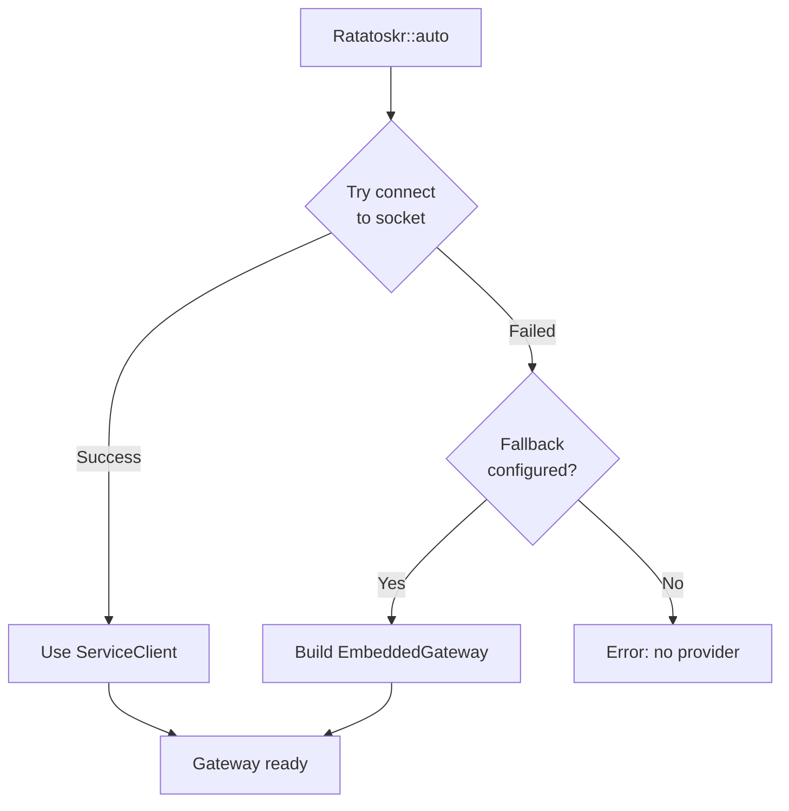
```mermaid
flowchart TD
    Start[Ratatoskr::auto] --> TryConnect{Try connect<br/>to socket}

    TryConnect -->|Success| ServiceClient[Use ServiceClient]
    TryConnect -->|Failed| CheckFallback{Fallback<br/>configured?}

    CheckFallback -->|Yes| BuildEmbedded[Build EmbeddedGateway]
    CheckFallback -->|No| Error[Error: no provider]

    ServiceClient --> Ready[Gateway ready]
    BuildEmbedded --> Ready
```

## Phase 6: Advanced Features

### Caching Strategy

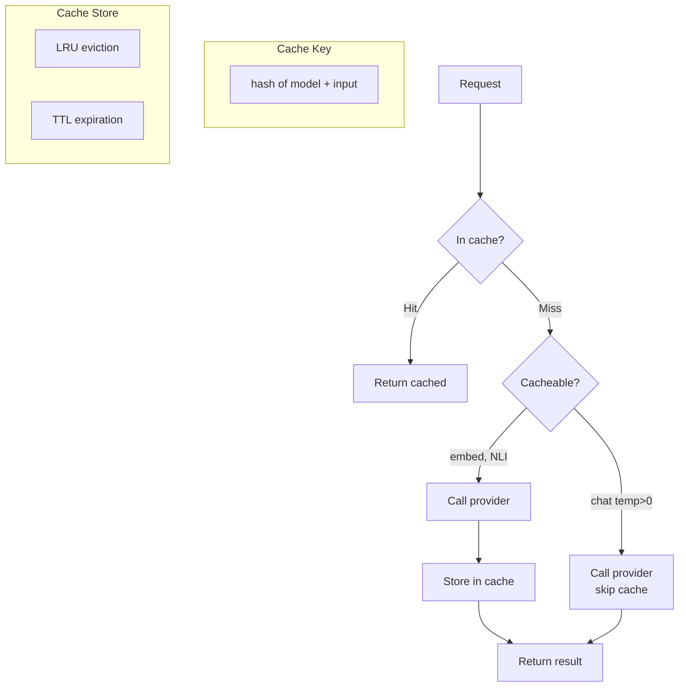
```mermaid
flowchart TB
    Request[Request] --> CacheCheck{In cache?}

    CacheCheck -->|Hit| CacheReturn[Return cached]
    CacheCheck -->|Miss| Cacheable{Cacheable?}

    Cacheable -->|embed, NLI| Provider[Call provider]
    Cacheable -->|chat temp>0| ProviderNoCache[Call provider<br/>skip cache]

    Provider --> Store[Store in cache]
    Store --> Return[Return result]
    ProviderNoCache --> Return

    subgraph "Cache Key"
        Key[hash of model + input]
    end

    subgraph "Cache Store"
        LRU[LRU eviction]
        TTL[TTL expiration]
    end
```

### Retry Logic

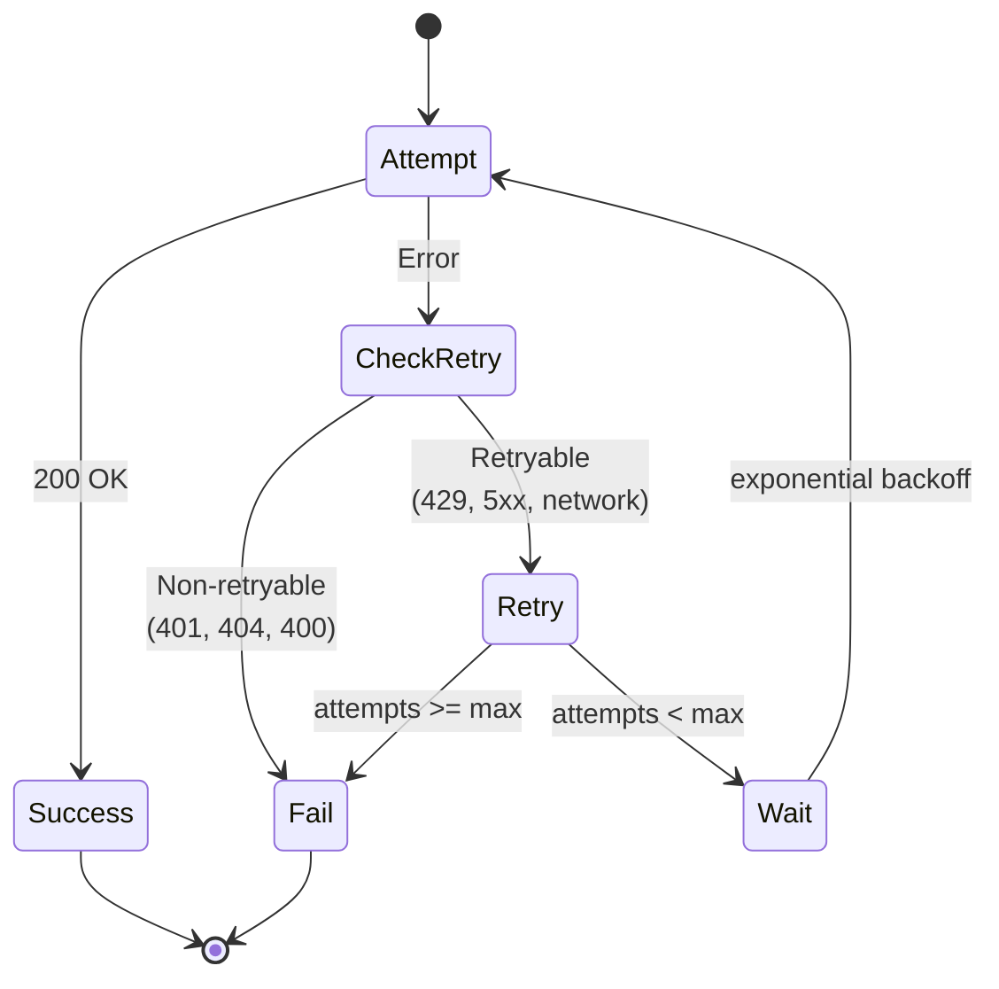
```mermaid
stateDiagram-v2
    [*] --> Attempt

    Attempt --> Success: 200 OK
    Attempt --> CheckRetry: Error

    CheckRetry --> Retry: Retryable<br/>(429, 5xx, network)
    CheckRetry --> Fail: Non-retryable<br/>(401, 404, 400)

    Retry --> Wait: attempts < max
    Retry --> Fail: attempts >= max

    Wait --> Attempt: exponential backoff

    Success --> [*]
    Fail --> [*]
```

### Routing Configuration

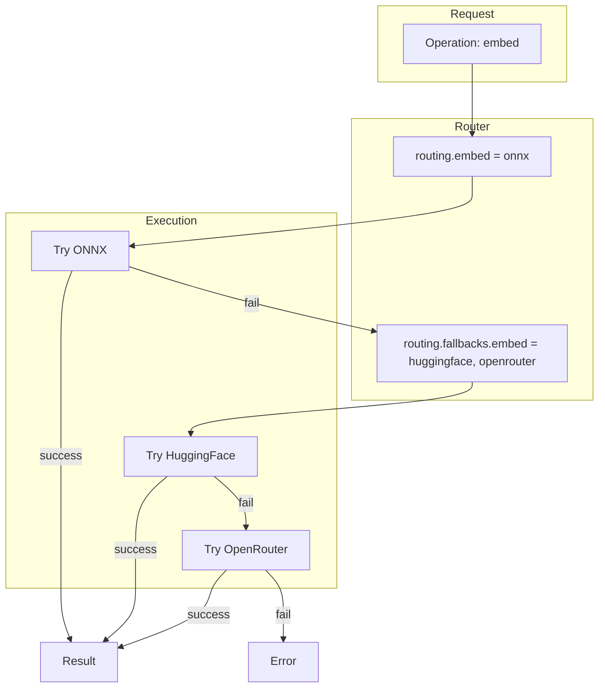
```mermaid
flowchart TB
    subgraph "Request"
        Op[Operation: embed]
    end

    subgraph "Router"
        Route[routing.embed = onnx]
        Fallback[routing.fallbacks.embed = huggingface, openrouter]
    end

    subgraph "Execution"
        Try1[Try ONNX]
        Try2[Try HuggingFace]
        Try3[Try OpenRouter]
    end

    Op --> Route
    Route --> Try1
    Try1 -->|fail| Fallback
    Fallback --> Try2
    Try2 -->|fail| Try3
    Try1 -->|success| Result
    Try2 -->|success| Result
    Try3 -->|success| Result
    Try3 -->|fail| Error
```

## Milestone Dependencies

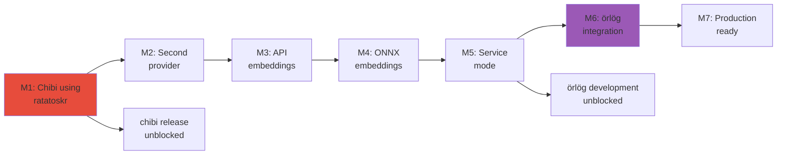
```mermaid
flowchart LR
    M1[M1: Chibi using<br/>ratatoskr] --> M2[M2: Second<br/>provider]
    M2 --> M3[M3: API<br/>embeddings]
    M3 --> M4[M4: ONNX<br/>embeddings]
    M4 --> M5[M5: Service<br/>mode]
    M5 --> M6[M6: örlög<br/>integration]
    M6 --> M7[M7: Production<br/>ready]

    M1 --> ChibiReady[chibi release<br/>unblocked]
    M5 --> OrlogReady[örlög development<br/>unblocked]

    style M1 fill:#e74c3c
    style M6 fill:#9b59b6
```

## Integration with örlög

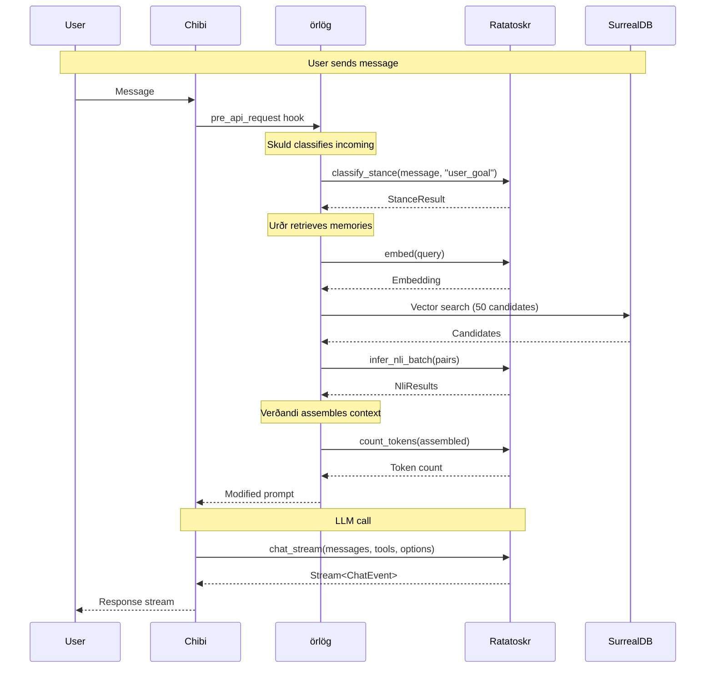
```mermaid
sequenceDiagram
    participant User
    participant Chibi
    participant Orlog as örlög
    participant Ratatoskr
    participant SurrealDB

    Note over User,SurrealDB: User sends message

    User->>Chibi: Message
    Chibi->>Orlog: pre_api_request hook

    Note over Orlog: Skuld classifies incoming

    Orlog->>Ratatoskr: classify_stance(message, "user_goal")
    Ratatoskr-->>Orlog: StanceResult

    Note over Orlog: Urðr retrieves memories

    Orlog->>Ratatoskr: embed(query)
    Ratatoskr-->>Orlog: Embedding

    Orlog->>SurrealDB: Vector search (50 candidates)
    SurrealDB-->>Orlog: Candidates

    Orlog->>Ratatoskr: infer_nli_batch(pairs)
    Ratatoskr-->>Orlog: NliResults

    Note over Orlog: Verðandi assembles context

    Orlog->>Ratatoskr: count_tokens(assembled)
    Ratatoskr-->>Orlog: Token count

    Orlog-->>Chibi: Modified prompt

    Note over Chibi,Ratatoskr: LLM call

    Chibi->>Ratatoskr: chat_stream(messages, tools, options)
    Ratatoskr-->>Chibi: Stream<ChatEvent>

    Chibi-->>User: Response stream
```

## Feature Flag Structure

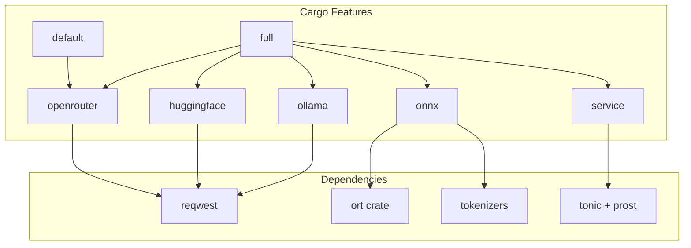
```mermaid
flowchart TB
    subgraph "Cargo Features"
        default[default]
        openrouter[openrouter]
        huggingface[huggingface]
        ollama[ollama]
        onnx[onnx]
        service[service]
        full[full]
    end

    subgraph "Dependencies"
        reqwest[reqwest]
        ort[ort crate]
        tonic[tonic + prost]
        tokenizers[tokenizers]
    end

    default --> openrouter
    full --> openrouter
    full --> huggingface
    full --> ollama
    full --> onnx
    full --> service

    openrouter --> reqwest
    huggingface --> reqwest
    ollama --> reqwest
    onnx --> ort
    onnx --> tokenizers
    service --> tonic
```
