# Phase 1 Diagrams

> Mermaid diagrams for the Phase 1 implementation plan.

## System Context

Where ratatoskr fits in the ecosystem:

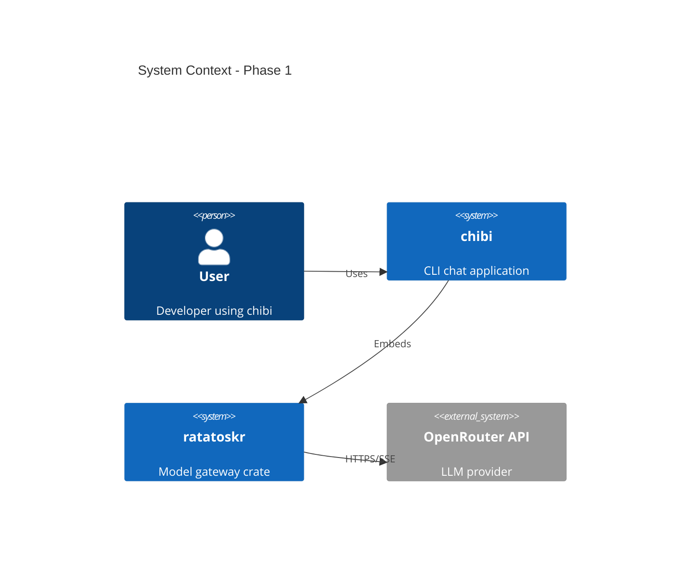

## Crate Structure

```mermaid
graph TB
    subgraph ratatoskr["ratatoskr crate"]
        lib[lib.rs<br/>Public API]

        subgraph types["types/"]
            message[message.rs<br/>Message, Role]
            tool[tool.rs<br/>ToolDefinition, ToolCall]
            options[options.rs<br/>ChatOptions]
            response[response.rs<br/>ChatResponse, ChatEvent]
            model[model.rs<br/>ModelInfo, Capabilities]
            future[future.rs<br/>Embedding, NliResult<br/>stubbed]
        end

        traits[traits.rs<br/>ModelGateway]
        error[error.rs<br/>RatatoskrError]

        subgraph embedded["embedded/"]
            emb_mod[mod.rs<br/>EmbeddedGateway]
            builder[builder.rs<br/>Builder pattern]
        end

        subgraph providers["providers/"]
            prov_mod[mod.rs<br/>Provider trait]
            openrouter[openrouter.rs<br/>OpenRouter impl]
        end
    end

    lib --> traits
    lib --> types
    lib --> error
    lib --> embedded

    traits --> types
    embedded --> providers
    embedded --> traits
    providers --> types

    style ratatoskr fill:#1a1a2e,stroke:#16213e
    style types fill:#0f3460,stroke:#16213e
    style embedded fill:#0f3460,stroke:#16213e
    style providers fill:#0f3460,stroke:#16213e
```

## Type Relationships

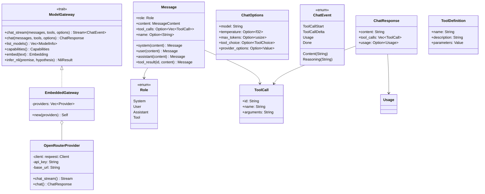

## Request Flow

### Non-Streaming Chat

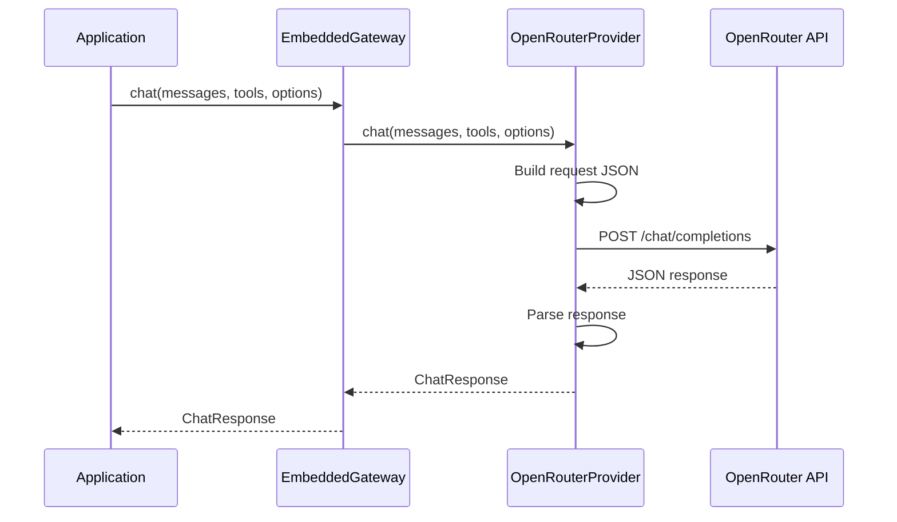

### Streaming Chat

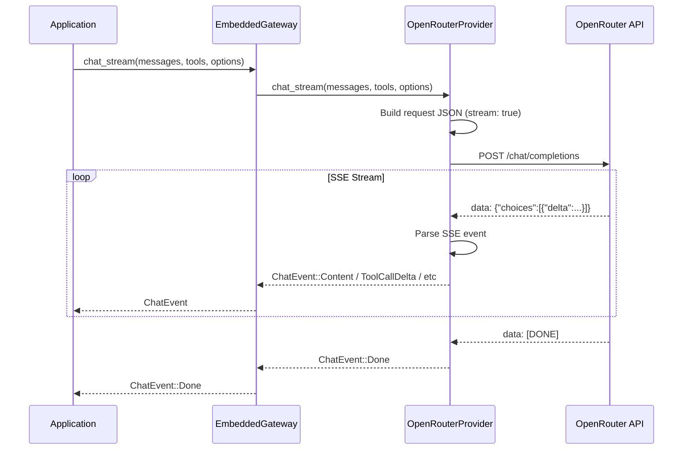

## SSE Parsing State Machine

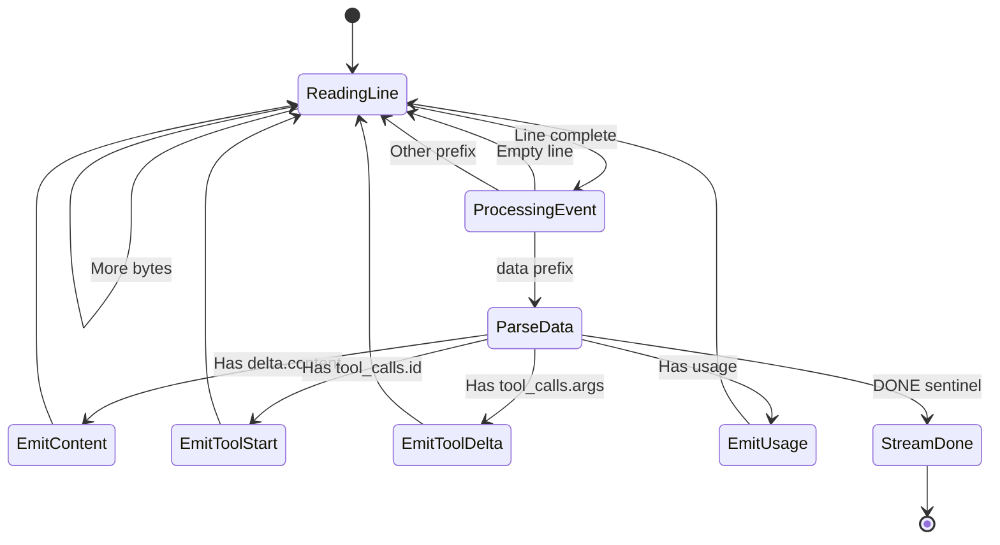

## Tool Call Flow

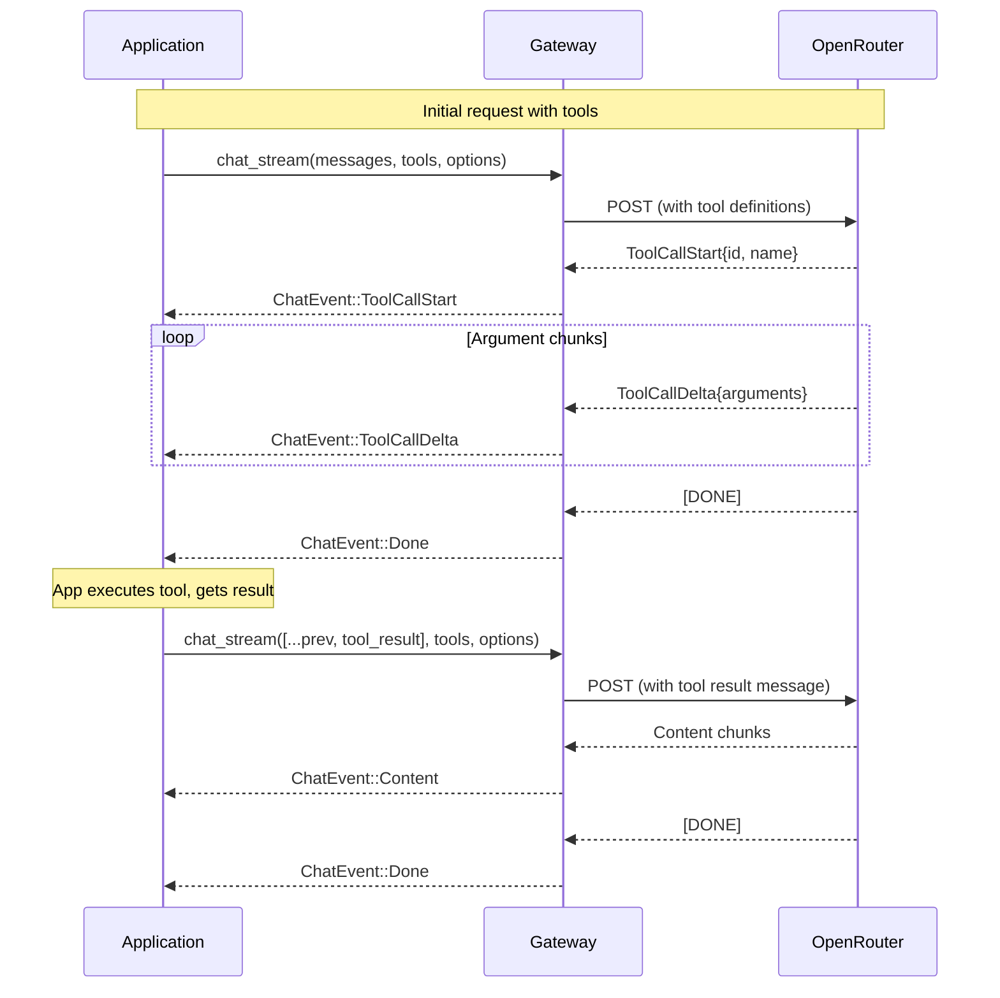

## Builder Pattern

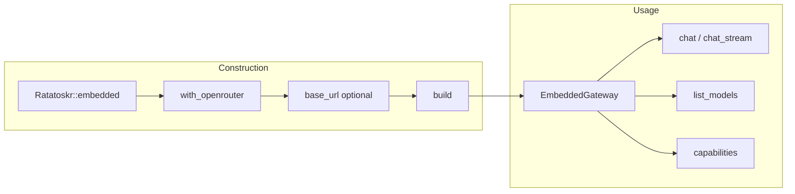

## Chibi Integration

### Before Extraction

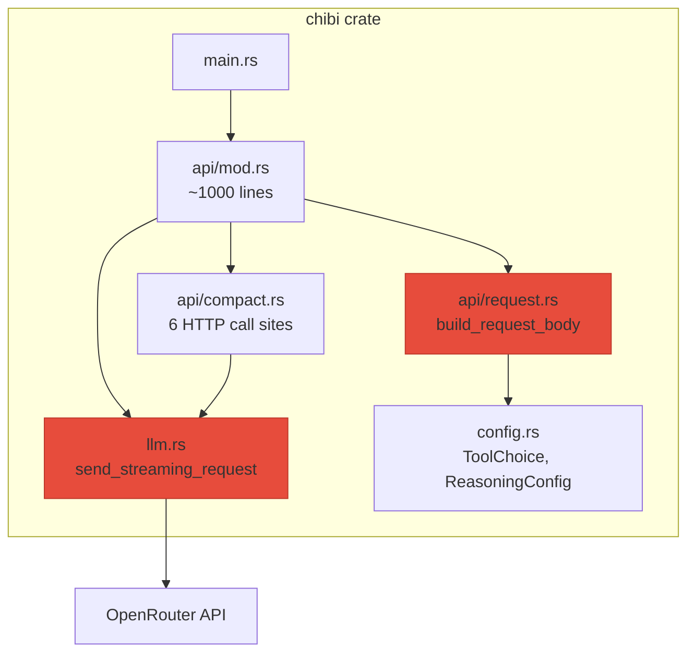

### After Extraction

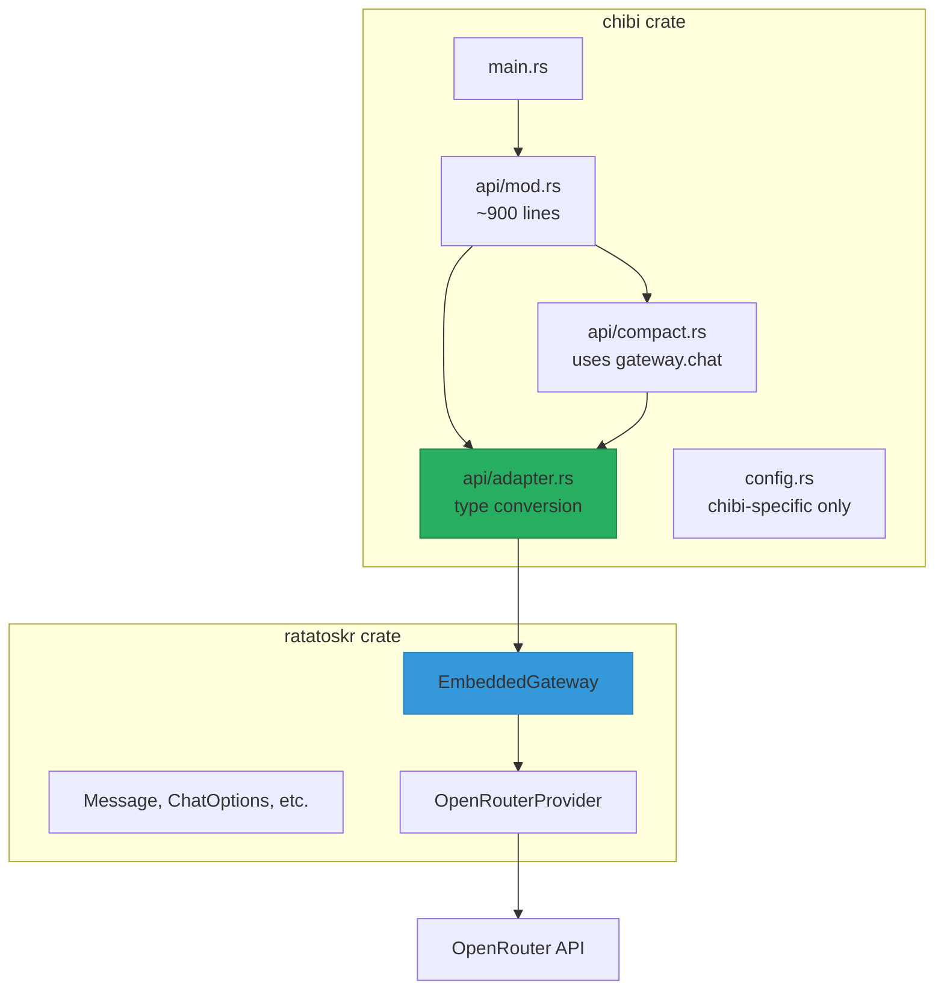

## Error Handling

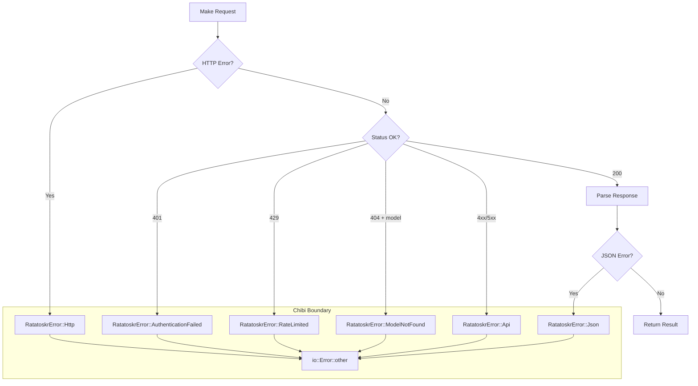

## Migration Steps

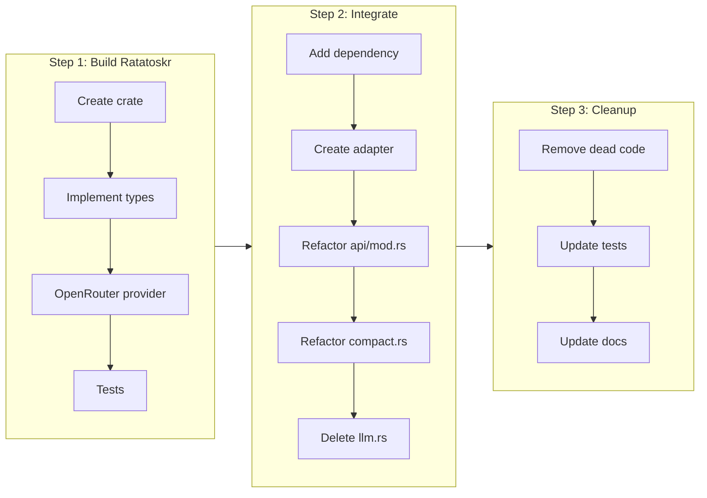
